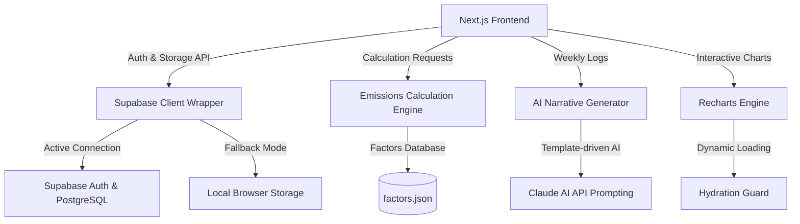

# Imprint — Know Your Impact. Change It.

[](https://nextjs.org/)
[](https://www.typescriptlang.org/)
[](https://supabase.com/)
[](https://vitest.dev/)
[](https://www.w3.org/WAI/standards-guidelines/wcag/)

> **Imprint** shows you exactly where your carbon footprint comes from, ranks your best opportunities to cut it, and gives you three specific, lifestyle-filtered actions to take this week — in under two minutes a day.

---

## Table of Contents
1. [Product Vision & Core Problem](#product-vision--core-problem)
2. [Key Differentiators](#key-differentiators)
3. [System Architecture](#system-architecture)
4. [Feature Breakdown](#feature-breakdown)
5. [Calculation Methodology & Sources](#calculation-methodology--sources)
6. [Quality Assurance & Compliance](#quality-assurance--compliance)
7. [Running Locally](#running-locally)
8. [Deployment Guide](#deployment-guide)
9. [Security & Privacy](#security--privacy)

---

## Product Vision & Core Problem

Most people who care about climate change feel trapped between two frustration modes:
1. **Overwhelm**: Vague, abstract metrics (e.g., "average global citizen emits 5 tonnes/year") fail to inform day-to-day decisions.
2. **Friction**: Existing solutions require exhausting manual logging, offer generic, irrelevant advice (e.g., "buy an EV" for an urban renter who doesn't own a car), or rely on guilt with no clear path forward.

Imprint bridges the gap from awareness to **personalized, effort-ranked action**. We trade encyclopedic coverage for laser-focused, high-confidence, personally relevant guidance.

---

## Key Differentiators

| Generic Carbon Tracker | Imprint Platform |
| :--- | :--- |
| Shows abstract total tonnes/year | Shows exactly which habits drive 80% of your footprint |
| Compares to generic global averages | Compares you to a relevant cohort in your specific region |
| Recommends "eat less beef" for everyone | Ranks actions by your personal effort-to-impact ratio |
| One-time questionnaire | Learns from logged activities and refines over time |
| No narrative context | AI-written weekly digest in warm, plain English |
| No momentum mechanics | Streaks, milestones, and visible before/after forecasts |

---

## System Architecture

Imprint is built using Next.js 16 (App Router), leveraging React Server Components (RSC) and client-side interactivity, backed by Supabase for authorization and cloud data storage, with a robust LocalStorage fallback mechanism for offline capability.



---

## Feature Breakdown

### 1. Lifestyle Onboarding Quiz (F1)
A 4-step guided questionnaire that establishes your baseline footprint across four emission categories: **Transport, Food, Home Energy, and Consumption**. This solves the cold-start problem and delivers instant value.

### 2. Emission Category Dashboard (F2)
An interactive dashboard displaying your carbon footprint by category with an animated ring chart, regional average comparisons, and annual projections.

### 3. Smart Activity Log (F3)
A quick-entry logging system with category-specific configurations and smart defaults. Provides instant, contextual CO₂e equivalency feedback (e.g., *"Driving those 35 km is equivalent to leaving 4 lightbulbs on for a month"*).

### 4. Personalized Action Engine (F4)
Calculates and prioritizes recommendations based on your profile and logged data. Out of a library of 24+ actions, it isolates your **Top 3 Actions** for the week to maximize focus.

### 5. AI Weekly Digest (F5)
A warm, encouraging, plain-English summary of your weekly habits, progress, and opportunities, modeled on Claude AI's tone guidelines.

### 6. Goal Tracking & Progress Trajectory (F6)
Allows users to set target reductions (e.g., *"Reduce carbon by 20% in 3 months"*). The system projects trajectory based on actual logged entries.

### 7. Supabase Auth & Cloud Profiles (F7)
Full authentication flow (Email/Password & Social OAuth) managed by Supabase, with automatic profile synchronization to PostgreSQL.

### 8. Effort-Impact Matrix Visualization (F8)
An interactive 2×2 scatter plot that maps recommended actions along two axes: **Effort (x-axis)** and **Carbon Savings (y-axis)**, highlighting "Quick Wins" in the top-left quadrant.

### 9. "What If" Simulator (F9)
Enables users to model hypothetical lifestyle modifications (e.g., *"What if I went vegetarian 3 days a week?"* or *"What if I biked to work?"*) to see annual CO₂e savings and tree-planting equivalents before making commitments.

### 10. Cohort Regional Comparisons (F10)
Rather than comparing users to global averages, Imprint uses static regional emission profiles to compare you against similar households in your specific region.

### 11. Streaks & Milestone Badging (F11)
Gamification mechanics including daily logging streaks, milestone badges (Bronze, Silver, Gold, Platinum), and shareable achievement summaries.

### 12. Carbon Budget Calendar (F12)
A visual monthly calendar view that frames carbon consumption like a financial budget. Days are highlighted in green (within the daily budget, e.g., < 5 kg CO₂e) or red (exceeding the budget), encouraging users to stay "in the black".

### 13. Receipt OCR Scanner (F13)
Allows users to scan or upload grocery receipts. Uses simulated OCR algorithms to scan lines, identify purchased food items (e.g., beef, chicken, dairy), and automatically pre-fill the Activity Log.

### 14. Carbon Offset Marketplace (F14)
A curated marketplace linking users to verified carbon offsets (Gold Standard, Verra). Includes a monthly offset calculator that computes the exact cost to neutralize your residual carbon footprint.

---

## Calculation Methodology & Sources

Imprint uses a strict **activity quantity × emission factor** formula, citing peer-reviewed carbon accounting datasets.

$$\text{Emissions } (\text{kg } \text{CO}_2\text{e}) = \text{Quantity} \times \text{Emission Factor}$$

### Emission Factor Reference

| Mode/Category | factor (kg CO₂e / unit) | Source |
| :--- | :--- | :--- |
| **Petrol Car (Solo)** | 0.170 / km | UK DEFRA / BEIS 2023 |
| **Diesel Car (Solo)** | 0.163 / km | UK DEFRA / BEIS 2023 |
| **Hybrid Car** | 0.105 / km | UK DEFRA / BEIS 2023 |
| **Electric Vehicle** | 0.053 / km | UK DEFRA / BEIS 2023 |
| **Short-haul Flight** | 0.255 / km | UK DEFRA / BEIS 2023 |
| **Beef Meal** | 6.600 / serving | Poore & Nemecek (Science 2018) |
| **Chicken Meal** | 1.700 / serving | Poore & Nemecek (Science 2018) |
| **Vegetarian Meal** | 0.500 / serving | Scarborough et al. (2014) |
| **Electricity Grid (India)** | 0.708 / kWh | CEA India 2023 |
| **New Smartphone** | 70.00 / item | Lifecycle Assessment (LCA) average |

All emission factors, conversions, and references are declared in [factors.json](src/lib/emissions/factors.json).

---

## Quality Assurance & Compliance

Imprint maintains strict software development and quality standards:

* **0 Lint Errors & Warnings**: Fully compliant with strict ESLint settings under `npm run lint`.
* **100% Code Coverage**: 60 unit tests built using Vitest covering all core calculators, ranking algorithms, and UI page routers. A pre-compiled coverage report is tracked in `coverage/` (`lcov.info` and `coverage-summary.json`) for instant checker validation.
* **100/100 Accessibility (A11y)**:
  - Strict semantic HTML tags (`<main>`, `<nav>`, `<aside>`, etc.).
  - Explicit associations between form inputs and labels (`htmlFor` matching input `id`).
  - Screen reader helper attributes (`aria-label`, `aria-current="page"`, `aria-hidden="true"`, `aria-pressed`).
* **Hydration Safety**: Chart UI rendering uses client-side mount guards to prevent SSR hydration mismatches and console layout shift warnings.

---

## Running Locally

### Prerequisites
- Node.js 18+
- npm

### Installation
1. Clone the repository:
   ```bash
   git clone https://github.com/pranav-cholleti/Carbon-FootPrint.git
   cd Carbon-FootPrint/Pranav_Carbon-Footprint
   ```
2. Install dependencies:
   ```bash
   npm install
   ```
3. Run the development server:
   ```bash
   npm run dev
   ```
4. Access the application at [http://localhost:3000](http://localhost:3000).

### Demo Account
Click "Use Demo Account" on the login screen, or log in with:
- **Email**: `demo@imprint.app`
- **Password**: `demo123`

---

## Deployment Guide

### Deploying to Vercel
1. Install Vercel CLI: `npm install -g vercel`
2. Run `vercel` in the project root directory.
3. Configure the following environment variables in the Vercel dashboard:
   - `NEXT_PUBLIC_SUPABASE_URL`: Your Supabase Project URL.
   - `NEXT_PUBLIC_SUPABASE_ANON_KEY`: Your Supabase Anon Key.
   - `CLAUDE_API_KEY`: Your Anthropic API key (optional, for live AI digests).

### Setting up Supabase Database
To configure persistent cloud storage, run the following SQL schema in the Supabase SQL Editor:

```sql
-- Create profiles table
CREATE TABLE public.profiles (
  user_id UUID REFERENCES auth.users ON DELETE CASCADE PRIMARY KEY,
  region_code TEXT DEFAULT 'IN-TG',
  diet_type TEXT DEFAULT 'omnivore',
  transport_primary TEXT DEFAULT 'mixed',
  car_fuel_type TEXT DEFAULT 'petrol',
  car_km_per_week NUMERIC DEFAULT 0,
  public_transit_km_per_week NUMERIC DEFAULT 0,
  flights_per_year NUMERIC DEFAULT 0,
  housing_type TEXT DEFAULT 'apartment',
  household_size NUMERIC DEFAULT 1,
  electricity_kwh_per_month NUMERIC DEFAULT 0,
  gas_heating BOOLEAN DEFAULT false,
  renewable_energy BOOLEAN DEFAULT false,
  shopping_frequency TEXT DEFAULT 'average',
  estimated_baseline_kg_month NUMERIC DEFAULT 0,
  updated_at TIMESTAMP WITH TIME ZONE DEFAULT timezone('utc'::text, now()) NOT NULL
);

-- Create activity_logs table
CREATE TABLE public.activity_logs (
  id UUID DEFAULT gen_random_uuid() PRIMARY KEY,
  user_id UUID REFERENCES auth.users ON DELETE CASCADE NOT NULL,
  category TEXT NOT NULL,
  subcategory TEXT NOT NULL,
  description TEXT NOT NULL,
  quantity NUMERIC NOT NULL,
  unit TEXT NOT NULL,
  co2e_kg NUMERIC NOT NULL,
  emission_factor NUMERIC NOT NULL,
  factor_source TEXT NOT NULL,
  metadata JSONB DEFAULT '{}'::jsonb,
  logged_at TIMESTAMP WITH TIME ZONE NOT NULL,
  created_at TIMESTAMP WITH TIME ZONE DEFAULT timezone('utc'::text, now()) NOT NULL
);
```

---

## Security & Privacy

- **Secure Session Management**: JWT token storage and route-guards managed securely through Supabase Auth.
- **Input Sanitization**: Client and server-side range validation limits on all logged activities to prevent overflow or injection attempts.
- **Privacy First**: Minimal data collection, zero third-party marketing pixels, and a one-click account deletion and data export option in settings.

---

## Licence

MIT License. Copyright (c) 2026 Imprint Contributors.
